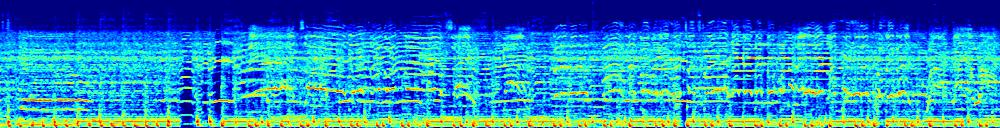
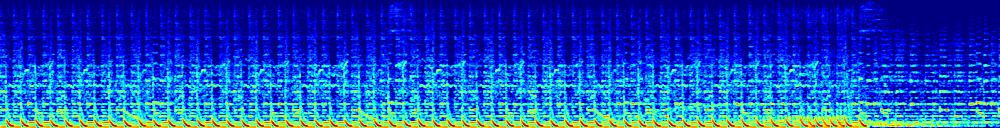
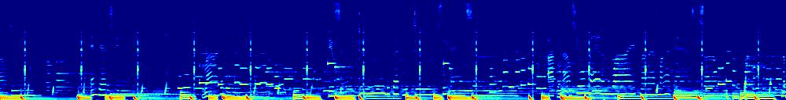
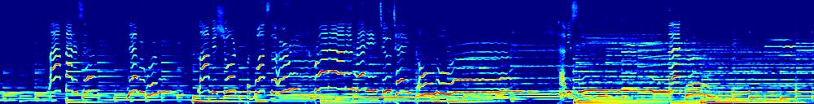

## Songs Emotion Dataset

This is a dataset of songs. You can download this dataset from: [Songs Emotion Dataset](https://code.soundsoftware.ac.uk/projects/emotion-recognition/repository/show/4.%20dataset%20(audio))

Additional cropping and conversion (to spectrogram) is needed using the conversion codes we provide in this project. Then you can execute `create_tfrecord.py` to assemble the dataset for training purpose.

It includes songs of 4 different styles: 

`angry`, `happy`, `relax`, `sad`

Reasonably this dataset incurs a more challenging task to the training module comparing with the "Piano Emotion Dataset", as human voice is incorporated now and more undetermined factors should be taken into account.

One solution to this challenging case suggests us to place more effort on the data preprocessing stage. By seperating foreground human voice from backgroud music, we can consequently apply different information extraction strategy on the raw audio data. This incurs considerable amount of noise to the raw audio data and extra effort should be devoted to relevant aspects. 

Apart from denosing tasks we need to perform. Plenty of tricks should be played as we wish to crest the peak of accuracy in songs emotion recognition. These tricks, however, is rather complicated to elaborate in several words. We will go further into details in the subsequent sections.

Here we present some examples of this dataset for your quick view:
### Angry

### Happy

### Relax

### Sad

