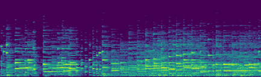

## Piano Emotion Dataset
This dataset is totaly collected and handmade by our team. It includes piano solos of 5 distinct styles: 

`angry`, `happy`, `horror`, `peaceful`, `sad`

The raw audio data is preprocessed and converted into standardization mel-spectrograms using the interface we provided in this system.

Intuitively we expect each style shares some degrees of common patterns in pace and frequency space. These patterns are usually hard for our eyes to indentify given a raw mel-spectrogram image but can be easily discerned by our ears. However our learning module should be capable of handling this level of tasks given that the network structure is a perfect mix of convolutional layers (simulating human eyes) and recursive layers (simulating human cochlea).

Here we present an example of this dataset for your quick view:
